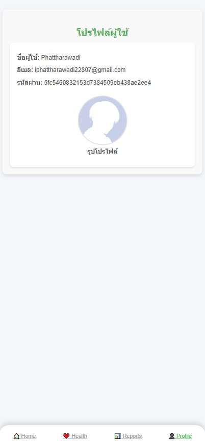
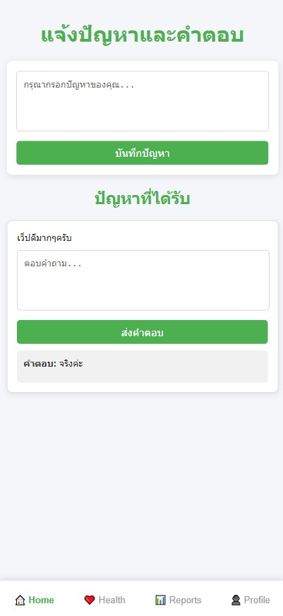
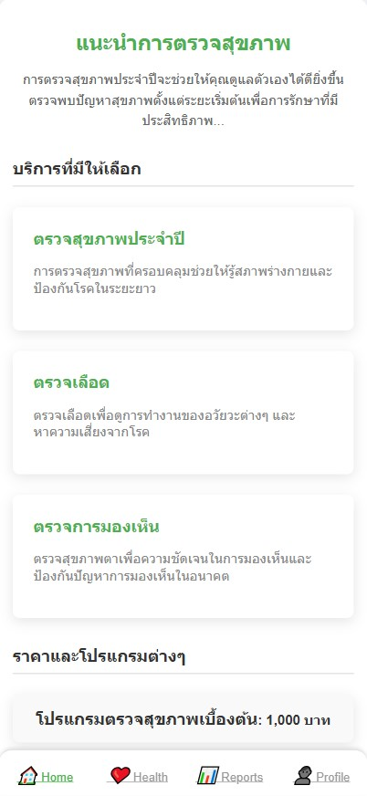
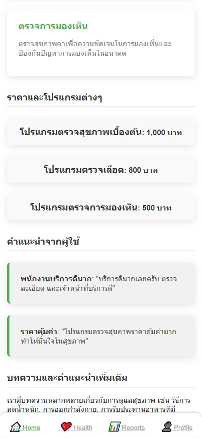

# 💡 health-checkup-bracelet

> Participate in the CEDT project  
> ระบบตรวจสอบสุขภาพผ่าน Web Application พร้อม UI ใช้งานง่าย

---

## 📱 UI Overview

รวมหน้าจอการใช้งานของระบบทั้งหมด:

---

## 🔐 Login Page

  

**คำอธิบาย:**  
หน้าสำหรับเข้าสู่ระบบ ประกอบด้วยช่องกรอก **ชื่อผู้ใช้** และ **รหัสผ่าน** พร้อมปุ่มเข้าสู่ระบบ และลิงก์ไปหน้าสมัครสมาชิก

---

## 📝 Register Page

  

**คำอธิบาย:**  
แบบฟอร์มสำหรับสมัครสมาชิกใหม่ กรอกข้อมูลพื้นฐาน เช่น ชื่อ อีเมล เบอร์โทรศัพท์ และรหัสผ่าน

---

## 👤 Profile Page

  

**คำอธิบาย:**  
หน้าโปรไฟล์ผู้ใช้ แสดงข้อมูลส่วนตัว และสามารถแก้ไขข้อมูลหรือออกจากระบบได้

---

## 📊 Report Page

  

**คำอธิบาย:**  
รายงานข้อมูลสุขภาพของผู้ใช้งาน แสดงในรูปแบบกราฟหรือแผนภูมิ เพื่อการวิเคราะห์เชิงลึก

---

## 💖 Health Page 1

  

**คำอธิบาย:**  
แสดงค่าทางสุขภาพพื้นฐาน เช่น น้ำหนัก ความดันโลหิต ดัชนีมวลกาย ฯลฯ

---

## 💖 Health Page 2

  

**คำอธิบาย:**  
ข้อมูลสุขภาพเพิ่มเติม เช่น กราฟแสดงค่าสุขภาพย้อนหลัง พร้อมรายละเอียดเพิ่มเติม
